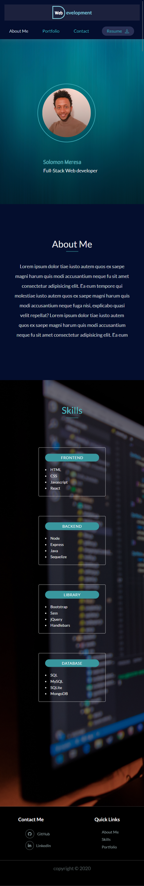
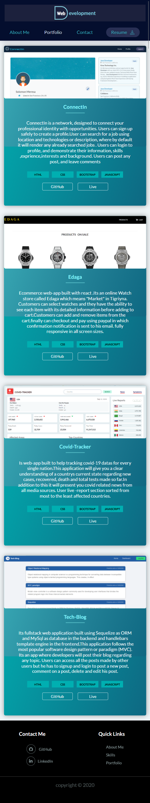
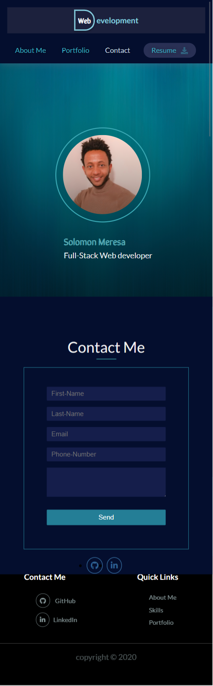

# Solo-portfolio

[](https://solomonmeresa.github.io/solo-portfolio/)

# Description

Solo-portfolio is a personal website listing some of my works and  introduction of my professional skills.

## Table of Contents

- [Visuals](#Visuals)
- [Installation](#Installation)
- [Dependencies](#Dependencies)
- [Reach Me](#Reach-Me)
- [Contribution](#Contribution)

# Dependencies

- react
- react-dom
- react-scripts
- web-vitals
- gh-pages
- react-pdf

# license


# Reach Me

[](https://github.com/solomonmeresa)

## Contribution

Fork it to your github ,then you can make any changes with out affecting the main source code

Once you create your database then run those scripts to seed and run server in your terminal

```javascript
npm install
npm run start
```

## Visuals

### LARGE SCREEN SIZE


### SMALL SCREEN SIZE





### ©️2020 Solo-portfolio
